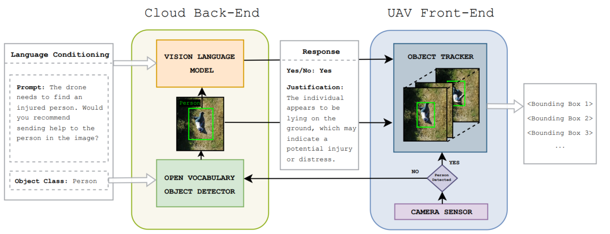

# CloudTrack: Scalable UAV Tracking with Cloud Semantics


**Authors**: [Yannik Blei](https://www.utn.de/person/yannik-blei/), [Michael Krawez](https://www.utn.de/en/person/michael-krawez/), [Nisarga Nilavadi](https://www.utn.de/person/nisarga-nilavadi-chandregowda/), [Tanja Katharina Kaiser](https://www.utn.de/person/tanja-kaiser/), [Wolfram Burgard](https://www.utn.de/person/wolfram-burgard-2/)

Nowadays, unmanned aerial vehicles (UAVs) are commonly used in search and rescue scenarios to gather information in the search area. The automatic identification of the person searched for in aerial footage could increase the autonomy of such systems, reduce the search time, and thus increase the missed person's chances of survival. In this paper, we present a novel approach to perform semantically conditioned open vocabulary object tracking that is specifically designed to cope with the limitations of UAV hardware. Our approach has several advantages. It can run with verbal descriptions of the missing person, e.g., the color of the shirt, it does not require dedicated training to execute the mission and can efficiently track a potentially moving person. Our experimental results demonstrate the versatility and efficacy of our approach.



**Refer to the official [publication](https://arxiv.org/pdf/2409.16111) for more information.**


## Installation:

### 1. Clone the repository


```bash
git clone https://github.com/utn-blei/CloudTrack
```
### 2. Install the dependencies
```bash
cd CloudTrack
python -m venv ./.cloudtrack
source ./.cloudtrack/bin/activate
pip install wheel
pip install setuptools
pip install typeguard
pip install -e .[backend]
```

### 3. Download the weights
```bash
mkdir -p models/groundingdino && cd models/groundingdino
wget -q https://github.com/IDEA-Research/GroundingDINO/releases/download/v0.1.0-alpha/groundingdino_swint_ogc.pth
cd ../..
```


## Run the Demo:
#### First: Run the backend
Run with **LLaVA 13b** as vlm (works out-of-the box):
```bash
python -m cloud_track backend
```
To use **ChatGPT** as a VLM, create an [OpenAI API Key](https://platform.openai.com/docs/quickstart) and call:

```bash
OPENAI_API_KEY=<Your Key Here> && python -m cloud_track backend --vlm gpt-4o-mini
```

### Second: Run the Demos
The demo connects to the backend via network. We assume both instances run on the same machine. Otherwise, please change IP address and port accordingly.

#### Run demo on a sample video:
```bash
python -m cloud_track video-demo --video-source assets/faint.mp4 --ip http://0.0.0.0 --port 3000
```
#### Run the interactive demo:
```bash
python -m cloud_track live-demo --video-source 0 --ip http://0.0.0.0 --port 3000 --cathegory "a person" --description "Is the person wearing a gray shirt?"
```

## Use CloudTrack as a baseline:
We support easy inference on your personal data for benchmarking purposes. The following command supports input from a folder of images or a video file.

### To run inference on your personal data, call:
```
python -m cloud_track video-demo --video-source 0 --ip http://0.0.0.0 --port 3000 --output-file "./output.json"
```

See [minimal_examply.py](minimal_examply.py) if you need more information for your analysis.

## Known issues:

### Freeze on Raspberry Pi (and potentially on other platforms): 

OpenCV has a bug, where importing av leads to 100% cpu utilization when calling ```cv2.imshow()```. 
(See [here](https://github.com/opencv/opencv/issues/21952))

#### We found a workaround: 
```bash
sudo apt-get install libavdevice-dev
pip install av==11.0.0 --no-binary av
```

## Usage

See [minimal_examply.py](minimal_examply.py) for further details on the implementation.
